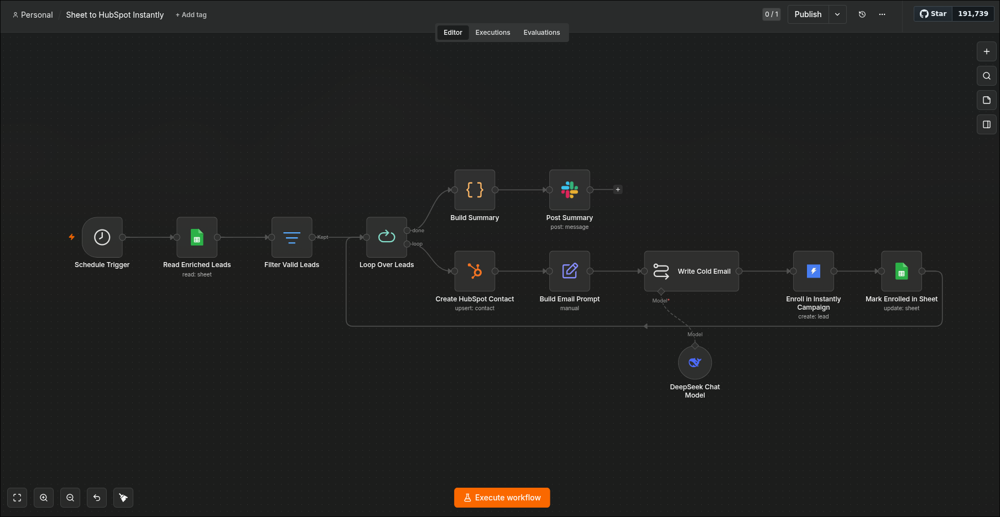

# Sheet to HubSpot + Instantly Campaign Launcher

## Demo Video

[](https://www.youtube.com/watch?v=VIDEO_ID)

---

## Workflow Overview



---

## What It Does

This workflow runs every morning at 10am and acts as the bridge between raw lead data and
active outreach. It reads the enriched lead list produced by the AI Lead Enrichment Pipeline,
creates or updates each person as a contact in HubSpot, and enrolls them in an Instantly.ai
email campaign — all automatically, with no manual copy-pasting between tools.

## Node-by-Node Flow

```
Schedule Trigger (10am daily)
  → Read Enriched Leads (Google Sheets)  — reads all rows from the lead output sheet
  → Loop Over Leads (splitInBatches)
      [loop port] → Create/Update HubSpot Contact  — upserts contact by email
                  → Enroll in Instantly Campaign    — adds lead to active outreach campaign
                  → (loops back)
      [done port] → (end — no summary node, completion is implicit)
```

## How It Fits Into the System

This workflow is **Stage 2** of the three-workflow sales pipeline:

1. **AI Lead Enrichment Pipeline** — discovers leads, verifies emails, generates personalized
   copy, and writes results to a Google Sheet
2. **This workflow** — reads that Google Sheet, pushes contacts into HubSpot, and kicks off
   email outreach via Instantly.ai
3. **Gmail Reply Classifier** — monitors the inbox for replies that come back from the
   Instantly campaigns and routes them into HubSpot based on intent

This workflow depends on the Google Sheet being populated by the AI Lead Enrichment Pipeline.
The 10am trigger is intentionally set one hour after the 9am enrichment run to give Stage 1
time to complete before Stage 2 reads from the sheet.

## Credentials Required

| Service | Credential Type | What It's Used For |
|---|---|---|
| Google Sheets | `googleSheetsOAuth2Api` | Reading the enriched lead rows |
| HubSpot | `hubspotAppToken` | Creating/updating contacts in the CRM |
| Instantly.ai | `instantlyApi` | Enrolling leads in email campaigns |

**Difficulty to run without credentials:** Moderate. Three credentials are needed, but all
three have accessible free or trial tiers. The main friction point is Instantly.ai: the
`campaign` field is not exposed in the n8n node UI on import and must be added manually via
"+ Add Field" after deploying. The campaign ID itself must be copied from the Instantly
dashboard. HubSpot has a free CRM tier. Google Sheets just needs an OAuth connection.

**Important:** After deploying this workflow to n8n, you must:
1. Open the "Enroll in Instantly Campaign" node
2. Click "+ Add Field" and select "Campaign"
3. Paste your Instantly campaign ID
4. Save the workflow

Without that step, leads will not be enrolled in any campaign.

## Demo Notes

- Run manually from n8n after ensuring the Google Sheet has at least a few rows of data
- The clearest demo sequence: show the Sheet with leads → run workflow → show new contacts
  appearing in HubSpot → show leads appearing in the Instantly campaign dashboard
- HubSpot contact creation is idempotent (upsert by email) — safe to re-run without duplicates
- For a demo without live data, manually add 2–3 test rows to the Google Sheet with
  real-looking names, emails, and company names before running
